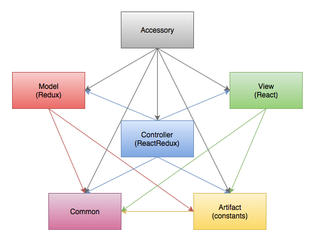

# Lord of the Rings Card Game
Play the game: [LotR Card Game](https://rawgit.com/jmthompson2015/lotr-card-game/master/src/index.html)

#### Accessories
* [Encounter Card Table](https://rawgit.com/jmthompson2015/lotr-card-game/master/src/accessory/encounter-card-table/EncounterCardTable.html)
* [Game Data Table](https://rawgit.com/jmthompson2015/lotr-card-game/master/src/accessory/game-data-table/GameDataTable.html)
* [Player Card Table](https://rawgit.com/jmthompson2015/lotr-card-game/master/src/accessory/player-card-table/PlayerCardTable.html)

* [Ally Card Gallery](https://rawgit.com/jmthompson2015/lotr-card-game/master/src/accessory/ally-card-gallery/AllyCardGallery.html)
* [Attachment Card Gallery](https://rawgit.com/jmthompson2015/lotr-card-game/master/src/accessory/attachment-card-gallery/AttachmentCardGallery.html)
* [Event Card Gallery](https://rawgit.com/jmthompson2015/lotr-card-game/master/src/accessory/event-card-gallery/EventCardGallery.html)
* [Hero Card Gallery](https://rawgit.com/jmthompson2015/lotr-card-game/master/src/accessory/hero-card-gallery/HeroCardGallery.html)

* [Enemy Card Gallery](https://rawgit.com/jmthompson2015/lotr-card-game/master/src/accessory/enemy-card-gallery/EnemyCardGallery.html)
* [Location Card Gallery](https://rawgit.com/jmthompson2015/lotr-card-game/master/src/accessory/location-card-gallery/LocationCardGallery.html)
* [Objective Card Gallery](https://rawgit.com/jmthompson2015/lotr-card-game/master/src/accessory/objective-card-gallery/ObjectiveCardGallery.html)
* [Quest Card Gallery](https://rawgit.com/jmthompson2015/lotr-card-game/master/src/accessory/quest-card-gallery/QuestCardGallery.html)
* [Treachery Card Gallery](https://rawgit.com/jmthompson2015/lotr-card-game/master/src/accessory/treachery-card-gallery/TreacheryCardGallery.html)

## Built With
* [Immutable](https://facebook.github.io/immutable-js/) - Immutable collections for JavaScript.
* [QUnit](https://qunitjs.com/) - JavaScript unit testing.
* [React](http://facebook.github.io/react/) - A JavaScript library for building user interfaces.
* [ReactRedux](https://github.com/reactjs/react-redux) - Official React bindings for Redux.
* [Reactable](http://glittershark.github.io/reactable/) - Fast, flexible, and simple data tables in React.
* [Redux](https://redux.js.org/) - A predictable state container for JavaScript apps.
* [Require.js](http://requirejs.org/) - A JavaScript file and module loader.
* [Tachyons](http://tachyons.io) - An atomic CSS library.

## Architecture

#### Common
Contains generic utilities and JavaScript extensions. (e.g. Logger, InputValidator, etc.)

#### Artifact
Contains game data implemented as constant enumerations. (e.g. HeroCard, AllyCard, EventCard, etc.)

#### Model
Provides the data model and processes using Redux.

#### View
Provides the GUI components using React.

#### Controller
Provides integration between the model and the view. Data changes are propagated to the view components, and user actions are transmitted to the model.

#### Accessory
Contains accessory applications.

## License
LotR Card Game is released under the terms of the [MIT License](https://github.com/jmthompson2015/lotr-card-game/blob/master/LICENSE.txt).

***
The Lord of the Rings: The Card Game and all related properties, images and text are owned by Fantasy Flight Games, and/or The Saul Zaentz Company d/b/a Middle-earth Enterprises.
